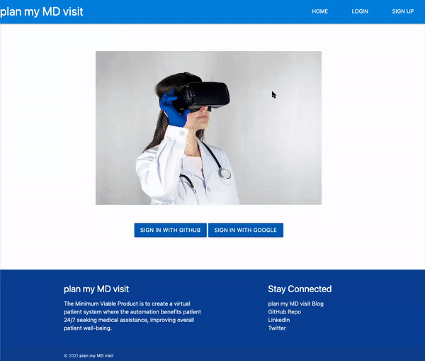

# Plan My MD Visit

<strong>Domain Modeling :: Virtual Healthcare</strong><br>
Welcome to my simplistic version of Virtual Healthcare system.<br> 
The automation benefits patients 24/7 seeking medical assistance, improving overall patient well-being!<br>

<div align="center">
  
</div>

<br>

<p><a href="https://youtu.be/0cRPsyLgx88">YouTube Demo</a></p>
<p><a href="https://dev.to/codinghall/plan-my-md-visit-c0l">DEV Blog</a></p>

## About

<p>The pandemic that has been lingering all around us since early 2020 has caused an apparent challenge to the current healthcare system. It is a testament to the new modern demand of digital healthcare. The conventional healthcare system is currently overflown with predominantly Covid-19 patients, exceeding their abilities to facilitate care of other medical patient needs.</p>
<p>The Minimum Viable Product (MVP) of Plan My MD Visit app is to create a virtual patient system where the automation benefits patient 24/7 seeking virtual medical assistance, improving overall patient well-being. My application carries essential features and minimal attributes of tele-health platforms. Patients make their visits to the clinic, laboratory or hospital only when necessary and/or advised by medical professionals.</p>

## Features

<div align="center">
  
</div>

<br>

<div align="center">
  
</div>

<br>

**Models** <br>
User, Patient, Healthcare Team, Doctor<br>

> user has_one :patient<br>
> user has_one :doctor

> patient `belongs_to` :user<br>
> patient `has_many` :healthcare_teams<br>
> patient `has_many` :doctors, `through:` :healthcare_teams

> healthcare_team `belongs_to` :patient<br>
> healthcare_team `belongs_to` :doctor

> doctor `belongs_to` :user<br>
> doctor `has_many` :healthcare_teams<br>
> doctor `has_many` :patients, `through:` :healthcare_teams

**Controller** <br>
ApplicationController<br>
UsersController<br>
PatientsController<br>
HealthcareTeamsController<br>
DoctorsController<br>

**User Account and Validation** <br>
Standard Authentication: Log In, Log Out, Sign Up.<br>
Provider Authentication: GitHub and Google OmniAuth.<br>

## API Database

- [x] <a href="https://data.cms.gov/provider-data/dataset/mj5m-pzi6">The Centers for Medicare & Medicaid Services</a>

> This file contains general information about individual eligible professionals (EPs) such as demographic information and Medicare quality program participation.

## Installation

```ruby
$ git clone 👾
$ bundle install
$ rails db:migrate 
$ rails db:seed
$ rails s
```

`rails db:seed` might take about 2-3 minutes extracting from `doctors.json` file.<br>
Open Chrome browser, and redirect to 'http://localhost:3000' to start the app.

## Stack
- [x] Active Record
- [x] Bcrypt
- [x] SQLite3
- [x] Simple Calendar
- [x] OmniAuth GitHub and Google
- [x] Open-URI
- [x] Nokogiri
- [x] JSON
- [x] Materialize CSS

## Resources

- [x] <a href="https://data.cms.gov/provider-data/dataset/mj5m-pzi6">The Centers for Medicare & Medicaid Services</a>
- [x] <a href="https://github.com/excid3/simple_calendar">Simple Calendar</a>
- [x] <a href="https://materializecss.com/">MaterializeCSS</a>